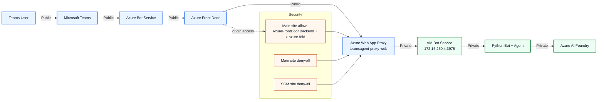
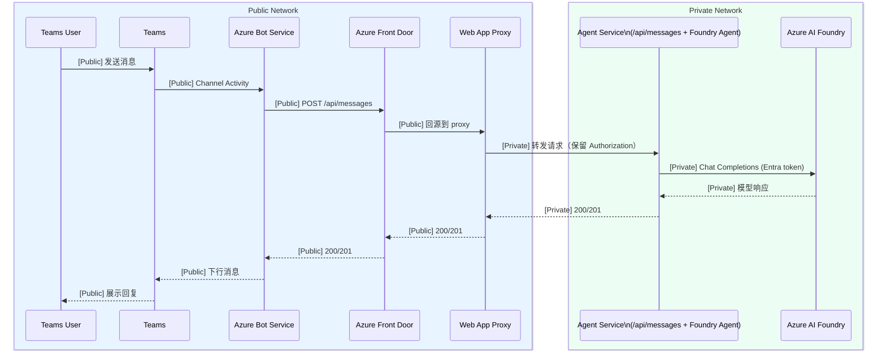

# Teams Agent App (Python + Azure)

本项目实现 Microsoft Teams 对话应用，并在 Azure 上采用 AFD + Proxy + 私网后端的生产链路。

## 0. 当前状态（已更新到最新设计）

截至 2026-04-22，当前生效设计为：

1. Teams -> Azure Bot Service（公网入口，固定 `/api/messages`）。
2. Azure Bot Service -> Azure Front Door（AFD）。
3. AFD -> Azure Web App Proxy（`teamsagent-proxy-web`）。
4. Proxy -> VM 私网 Bot 服务（`http://172.16.250.4:3978`）。
5. VM 内 Bot/Agent -> Azure AI Foundry（Managed Identity / Entra token）。

说明：

- 当前已从“Proxy 回源 Container App 私网地址”的不稳定路径切回 VM 私网路径。
- Foundry 认证以 Managed Identity 为主，不再依赖 API Key。

## 1. 架构图（最新）



### 1.1 关键组件

- Teams / Bot Service：消息通道与 Bot Framework 入口。
- AFD：统一外部入口与回源控制。
- Web App Proxy：仅转发 `/api/messages` 与 `/healthz`，不承载业务推理。
- VM Bot Service：承载 Python Bot + Agent 主逻辑。
- Azure AI Foundry：模型推理，使用 Entra token（MI）鉴权。

## 2. 流程图（消息链路）



### 2.1 图例（Legend）

- 蓝色区域/节点：公网流量路径（Public Network）。
- 绿色区域/节点：私有网络流量路径（Private Network）。
- 橙色节点：安全控制点（AFD 回源限制与拒绝策略）。
- 连线或消息中的 `[Public]` / `[Private]`：该次调用所属网络路径。

## 3. 安全策略（已验证）

当前 `teamsagent-proxy-web` 已确认生效的访问限制：

1. 主站独立规则（`scmIpSecurityRestrictionsUseMain=false`）。
2. 主站 Allow 规则：`allow-afd-backend-fdid`。
   - `service-tag=AzureFrontDoor.Backend`
   - Header 约束：`x-azure-fdid=<frontDoorId GUID>`
   - `priority=100`
3. 主站 Deny-All：`deny-all-main`，`priority=2147483647`。
4. SCM Deny-All：`deny-all-scm`，`priority=2147483647`。

这保证了 Proxy 主站仅允许来自指定 AFD 实例的回源访问，且 SCM 管理面默认拒绝。

## 4. 关键配置

### 4.1 应用配置（Bot/Agent）

见 `.env.example`：

- `FOUNDRY_AUTH_MODE=entra`
- `FOUNDRY_API_VERSION=2024-10-21`
- `FOUNDRY_ENTRA_SCOPE=https://cognitiveservices.azure.com/.default`
- `FOUNDRY_MANAGED_IDENTITY_CLIENT_ID`（仅用户分配身份时填写）

代码参考：

- `src/config.py`：认证模式与必填项校验。
- `src/agent/foundry_agent.py`：`DefaultAzureCredential` + `AsyncAzureOpenAI`。
- `src/app.py`：Bot Adapter 与 `/api/messages` 入口。

### 4.2 Proxy 配置

Proxy 关键环境变量：

- `PROXY_UPSTREAM_BASE_URL=http://172.16.250.4:3978`
- `PROXY_UPSTREAM_HOST_HEADER=`（VM 模式通常留空）
- `PROXY_TIMEOUT_SECONDS=120`

代码参考：`src/proxy_app.py`。

## 5. 本地运行

```powershell
python -m venv .venv
.\.venv\Scripts\Activate.ps1
pip install -r requirements.txt
python src/app.py
```

本地入口：`http://localhost:3978/api/messages`

## 6. Teams 安装

1. 编辑 `teams/manifest.json`，填入真实 `botId`。
2. 打包 `manifest.json`、`color.png`、`outline.png` 为 zip。
3. 在 Teams 上传自定义应用并安装测试。

## 7. 最新测试与验证结果

### 7.1 功能验证

- Teams 实际会话已恢复可用（用户确认“已经通了”）。
- Proxy `/healthz` 可正常响应。
- `/api/messages` 链路可完成 Bot 收发与模型回复。

### 7.2 安全验证

- 已复核 AFD-only 回源规则、主站 deny-all、SCM deny-all 全部存在。
- `x-azure-fdid` 绑定值已与 AFD 实例匹配。

### 7.3 运行与日志验证

- Proxy 日志可见转发目标与上游响应状态。
- VM 身份与 Foundry RBAC 已完成修复，Managed Identity 路径可用。

## 8. 运行建议（生产）

1. 保持 Bot Service 公开入口，但限制 Proxy 仅允许 AFD 指定实例回源。
2. 保持 Foundry 使用 MI + RBAC，避免回退到 API Key。
3. 为 Proxy 与 VM 应用保留健康探针和结构化日志。
4. 若后续启用 AFD Private Link Origin，可进一步收敛回源面。

## 9. 已知事项

- 目标资源组中当前仅确认 `teamsagent-proxy-web` 已完成并验证规则。
- `teamsagentafd-proxy-web` 在当前目标资源组查询为 ResourceNotFound，如需同策略加固请先确认其实际资源组/订阅。
