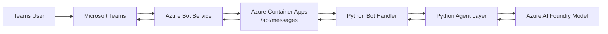
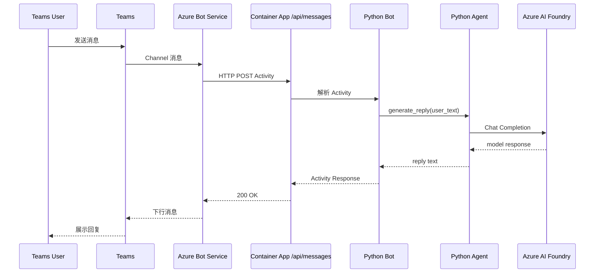

# Teams Agent App (Python + Azure)

本项目实现一个可部署到 Microsoft Teams 的对话应用，满足以下目标：

1. 可安装到 Teams。
2. 通过 Azure Bot Service 对接 Teams。
3. Azure Bot Service 消息端点指向 Azure Container Apps。
4. Container App 中运行 Python Agent，调用 Azure AI Foundry 模型。
5. Foundry 模型 ID 与 API Key 通过环境变量注入。

## 1. 架构设计

### 1.1 组件说明

- Teams Client
  - 用户发送消息并接收回复。
- Teams App Manifest
  - 定义 Bot 能力并绑定 Azure Bot ID。
- Azure Bot Service
  - 负责 Teams Channel 接入和消息转发。
- Azure Container Apps
  - 暴露 `/api/messages` webhook，承载 Python Bot + Agent 服务。
- Python Bot (Bot Framework)
  - 接收活动消息，调用 Agent，回写响应。
- Python Agent (Foundry)
  - 使用 Foundry Endpoint + Model ID + API Key 生成回答。

### 1.2 总体架构图



## 2. 调用逻辑

### 2.1 时序流程



### 2.2 关键约束

- Bot 消息入口固定为 `/api/messages`。
- Bot App ID / Password 必须与 Azure Bot Service 保持一致。
- Foundry 的 Endpoint、Model ID、API Key 全部来源于环境变量。
- Container App 需要公网入口，且 target port 为 `3978`。

## 3. 代码结构

```text
teams-app/
  README.md
  requirement.txt
  requirements.txt
  Dockerfile
  .env.example
  src/
    app.py
    bot.py
    config.py
    agent/
      foundry_agent.py
  teams/
    manifest.json
    color.png
    outline.png
  infra/
    main.bicep
    main.parameters.json
  scripts/
    deploy.ps1
    start_local.ps1
```

## 4. 本地运行

### 4.1 准备环境

- Python 3.11+
- Azure CLI
- 已创建 Azure AD App（用于 Bot App ID / Password）

### 4.2 安装依赖

```powershell
python -m venv .venv
.\.venv\Scripts\Activate.ps1
pip install -r requirements.txt
```

### 4.3 配置环境变量

复制 `.env.example` 为 `.env` 并填写：

- `BOT_APP_ID`
- `BOT_APP_PASSWORD`
- `FOUNDRY_ENDPOINT`
- `FOUNDRY_MODEL_ID`
- `FOUNDRY_API_KEY`
- `SYSTEM_PROMPT` (可选)

### 4.4 启动服务

```powershell
python src/app.py
```

服务监听：`http://localhost:3978/api/messages`

## 5. 生成云资源与部署

本项目同时提供两种方式：

1. `infra/main.bicep`：基础资源定义（Container App + Log Analytics + Bot Service）。
2. `scripts/deploy.ps1`：一键部署脚本（推荐，包含镜像构建和 Bot endpoint 自动绑定）。

### 5.1 一键部署（推荐）

```powershell
./scripts/deploy.ps1 \
  -SubscriptionId "<sub-id>" \
  -ResourceGroup "rg-teams-agent" \
  -Location "eastus" \
  -NamePrefix "teamsagent" \
  -BotAppId "<bot-app-id>" \
  -BotTenantId "<tenant-id>" \
  -BotAppPassword "<bot-app-password>" \
  -FoundryEndpoint "https://<foundry-endpoint>/openai/v1" \
  -FoundryModelId "<model-id>" \
  -FoundryApiKey "<foundry-api-key>"
```

脚本会完成：

- 创建资源组
- 创建 ACR
- 构建并推送镜像
- 创建 Log Analytics + Container Apps Environment
- 创建 Container App 并注入环境变量
- 创建 Azure Bot Service，endpoint 指向 Container App
- 开启 Teams Channel

## 6. Teams 应用安装

1. 打开 `teams/manifest.json`。
2. 将 `botId` 从 `00000000-0000-0000-0000-000000000000` 替换为真实 Bot App ID。
3. 准备 192x192 `color.png` 和 32x32 `outline.png` 图标。
4. 将 `manifest.json`、`color.png`、`outline.png` 打包为 zip。
5. Teams -> Apps -> Manage your apps -> Upload a custom app。

## 7. 生产建议

- 将 `BOT_APP_PASSWORD`、`FOUNDRY_API_KEY` 存储到 Azure Key Vault，再通过 Container Apps Secret 引用。
- 为 Container App 配置最小副本和自动扩缩容策略。
- 为 Agent 增加会话历史、审计日志和提示词安全策略。
- 开启 Application Insights 与分布式追踪。

## 8. 常见问题（认证与网络）

### 8.1 创建 Bot 时 Type of App 选项有什么区别

- `Single Tenant`
  - 使用 Entra 应用注册（App ID + Secret/证书）。
  - 仅允许本租户使用。
  - 兼容性高，适合当前 Python Bot Framework 方案。
- `User-Assigned Managed Identity`
  - 使用 Azure 托管身份，减少 Secret 管理。
  - 适合希望减少凭据维护的场景，但 Bot Framework Python 方案改造成本较高。

### 8.2 配置片段里的参数分别从哪里来

以下参数与本项目环境变量/配置映射：

- `appId` -> `BOT_APP_ID`
  - 来源：Entra 应用注册的 Application (client) ID。
  - 参考：`src/config.py`。
- `appPassword` -> `BOT_APP_PASSWORD`
  - 来源：Entra 应用注册的 Client Secret。
  - 参考：`src/config.py`、`scripts/deploy.ps1`。
- `tenantId` -> `BOT_APP_TENANT_ID`
  - 来源：Entra 的 Directory (tenant) ID。
  - 参考：`src/config.py`、`src/app.py`。
- `webhook.port` / `webhook.path`
  - 本项目固定为 `3978` 和 `/api/messages`。
  - 参考：`src/app.py`。

### 8.3 Bot Service 与 Container App 如何认证

调用链路：

1. Teams -> Azure Bot Service。
2. Azure Bot Service -> Container App 的 `/api/messages`。
3. Container App 在 `adapter.process_activity(...)` 中校验 `Authorization: Bearer <token>`。

关键点：

- Bot Service 与 Container App 必须使用同一个 `BOT_APP_ID`（以及对应租户和凭据）。
- `Single Tenant` 模式下，`BOT_APP_TENANT_ID` 必须与 Bot 资源的 tenant 一致。
- Token 校验入口在 `src/app.py` 的 `process_activity` 调用。

## 9. Teams 测试页面结果

根据测试页面会话截图，当前 Teams 端验证结果如下：

- Bot 能在个人聊天窗口正常接收并回复消息。
- 输入 `hello` 后，Bot 返回欢迎语，说明消息通道可用。
- 输入模型相关问题后，Bot 返回完整文本响应，说明 Bot -> Container App -> Agent 调用链可用。

建议继续执行以下回归测试：

- 在 `personal`、`groupchat`、`team` 三种 scope 分别发送消息。
- 连续多轮提问，观察是否出现超时或无响应。
- 结合 `az containerapp logs show` 检查 `Foundry response received` 日志是否持续输出。
