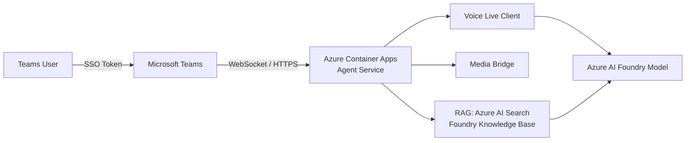
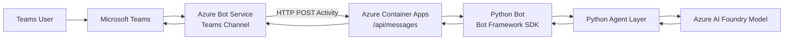
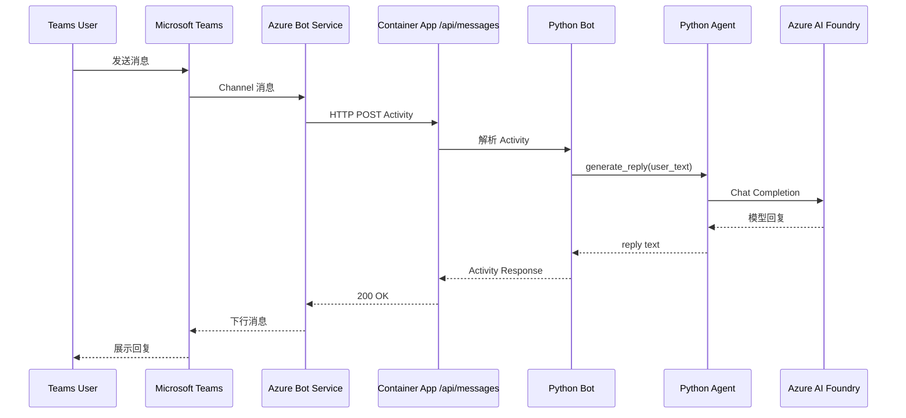

# Teams App 集成 Custom Agent 方案总结

本文档对比两种将 Microsoft Teams 应用与自定义 AI Agent 集成的架构方案。

---

## 方案对比一览

| 维度 | 方案一：直连 Agent Service | 方案二：经由 Bot Service 中转 |
|------|--------------------------|------------------------------|
| 入口协议 | HTTPS / WebSocket（实时音视频） | HTTP POST（Bot Framework Activity） |
| 核心组件 | Teams SSO + Voice Live / Agent Service | Azure Bot Service + Bot Framework SDK |
| 交互模式 | 实时语音流（低延迟） | 文本消息（请求-响应） |
| 身份认证 | Teams SSO（JWT 验证） | Bot App ID / Password |
| 部署复杂度 | 中（需配置 Entra App + SSO） | 中（需配置 Bot Service Channel） |
| 适用场景 | 自定义UI交互界面,语音交互、实时对话 | 文本聊天、指令型 Bot |

---

## 方案一：Teams App 直连 Agent Service

### 架构描述

Teams 客户端通过 **Teams SSO** 获取身份令牌，直接向部署在 Azure Container Apps 的 Agent Service 发起连接。Agent Service 内嵌 Voice Live 客户端与 Media Bridge，将 Teams 音频流实时传递给 Azure AI Foundry 模型。

### 架构图



### 核心流程

1. Teams 前端通过 `getAuthToken()` 获取 SSO JWT Token。
2. 后端校验 JWT 的 `iss`（Issuer）和 `aud`（Audience）。
3. 用户语音经 Media Bridge 实时传输给 Voice Live。
4. （可选）语音转文字后触发 RAG 检索，将上下文注入模型 Prompt。
5. 模型回复经 Voice Live 合成语音并返回 Teams 客户端。

### 关键配置

```env
TEAMS_SSO_ENABLED=true
TEAMS_TENANT_ID=<tenant-id>
TEAMS_SSO_CLIENT_ID=<clientId>
TEAMS_SSO_ALLOWED_AUDIENCES=<clientId>,api://<tab-domain>/<clientId>

# RAG（可选）
RAG_ENABLED=true
FOUNDRY_KB_SEARCH_ENDPOINT=<search-endpoint>
FOUNDRY_KB_SEARCH_API_KEY=<search-key>
FOUNDRY_KB_SEARCH_INDEX=<index-name>
```

### Teams Manifest 要点

```json
{
  "permissions": ["identity"],
  "webApplicationInfo": {
    "id": "<clientId>",
    "resource": "api://<your-tab-domain>/<clientId>"
  },
  "validDomains": ["<your-tab-domain>"]
}
```

### 优缺点

**优点**
- 低延迟，支持实时语音交互。
- 原生 SSO，用户体验流畅。
- RAG 上下文可在语音对话中动态注入。

**缺点**
- 需要额外配置 Entra App 的 `identifierUris` 和 `preAuthorizedApplications`。
- 音视频流处理复杂度较高（Media Bridge 需自行实现）。
- SSO Token 的 `aud` 值在不同 Teams 客户端（Web/Desktop/Mobile）可能不同，需全部加入白名单。

---

## 方案二：经由 Azure Bot Service 中转

### 架构描述

Teams 将用户消息发送到 **Azure Bot Service**，Bot Service 作为 Teams Channel 的接入层，将消息转发至运行在 Azure Container Apps 的 Python Bot（基于 Bot Framework SDK）。Python Bot 调用内部 Agent 层，Agent 层向 Azure AI Foundry 模型发起推理请求，结果逐层回传至 Teams 用户。

### 架构图



### 时序流程



### 关键配置

```env
BOT_APP_ID=<bot-app-id>
BOT_APP_PASSWORD=<bot-app-password>
FOUNDRY_ENDPOINT=https://<foundry-endpoint>/openai/v1
FOUNDRY_MODEL_ID=<model-id>
FOUNDRY_API_KEY=<foundry-api-key>
SYSTEM_PROMPT=<可选>
```

### 部署要点

- Bot 消息入口固定为 `/api/messages`，Container App 需开放公网访问，`target port` 为 `3978`。
- Bot App ID / Password 必须与 Azure Bot Service 注册保持一致。
- Teams Manifest 中 `botId` 填写真实 Bot App ID。
- 推荐使用 `scripts/deploy.ps1` 一键完成资源创建、镜像构建和 Teams Channel 开启。

### 优缺点

**优点**
- 架构清晰，Bot Framework SDK 处理 Teams 协议细节（签名验证、Activity 解析）。
- 不需要配置 SSO，认证由 Bot Service 负责。
- 易于扩展：可在 Agent 层增加会话历史、审计日志、Prompt 安全策略。
- 官方支持，文档丰富。

**缺点**
- 消息经过 Bot Service 中转，增加一跳延迟。
- 仅支持文本/卡片消息，不原生支持实时音频流。
- Bot App Password 属于凭据，需妥善存储（建议 Azure Key Vault）。

---

## 选型建议

### Teams UI 扩展点说明

Teams 平台的 UI 扩展点分三类：**Tab（含会议侧边栏）**、**聊天消息**、**会议扩展**。

| UI 扩展点 | 说明 | 方案一 | 方案二 |
|-----------|------|--------|--------|
| **Tab** | 本质是嵌入 Teams 的 `<iframe>` 网页，支持任意前端技术栈，UI 自由度最高 | ✅ 支持 | ✅ 支持 |
| **聊天消息** | 内容受 Teams 严格控制，仅支持文本、Markdown、Adaptive Card | ⚠️ 卡片交互仅限 `openURL` | ✅ 完整交互（表单提交、Task Module 弹窗） |
| **会议扩展** | 实时获取会议事件（参会者变化、字幕等） | ❌ 不支持 | ✅ 支持 |

> **关键差异**：两种架构都能实现完全自定义的 Tab UI（嵌入网页）。但一旦涉及聊天窗口的丰富交互（`Action.Submit`、多步对话、流式输出）或获取会议实时上下文，**必须使用方案二（Bot 架构）**。

### 使用场景选型

**选方案一（直连 Agent Service）当：**

- 需要**实时语音对话**（语音输入/输出、会议语音助手）
- 对**延迟敏感**，无法接受额外中转跳
- 仅需 Tab 形式嵌入自定义 UI（仪表盘、自带输入框的对话界面）
- 基于 Teams SSO 做**用户身份**权限控制
- 典型场景：语音助手、实时客服、会议翻译助手

**选方案二（经由 Bot Service 中转）当：**

- 交互以**文本消息**为主，需要发送 Adaptive Card（表单、按钮、多步对话）
- 需要在**聊天窗口**内完成完整交互流程（`Action.Submit`、Task Module 弹窗）
- 需要**流式响应**（逐字输出）或**获取会议实时事件**
- 需要支持**个人聊天 + 群组聊天 + Channel**多种会话场景
- 需要对接**多渠道**（Teams、Slack、Web Chat 复用同一 Bot）
- 典型场景：FAQ Bot、审批通知 Bot、DevOps 助手、会议纪要 Bot

**一句话总结：**

> 如果只是在 Teams 中**嵌入自己设计的网页**（Tab），两种方案均可。  
> 如果需要在 **Teams 聊天窗口内**做丰富交互或获取会议实时上下文，必须选方案二。  
> 如果核心场景是**实时语音**，选方案一。

- 两种方案均可共用同一套 Azure AI Foundry 模型后端，仅前端接入层不同。

---

## 参考文档

- [Azure Bot Service 文档](https://learn.microsoft.com/azure/bot-service/)
- [Teams SSO 配置指南](https://learn.microsoft.com/microsoftteams/platform/tabs/how-to/authentication/tab-sso-overview)
- [Azure AI Foundry](https://learn.microsoft.com/azure/ai-foundry/)
- [Bot Framework Python SDK](https://github.com/microsoft/botbuilder-python)
